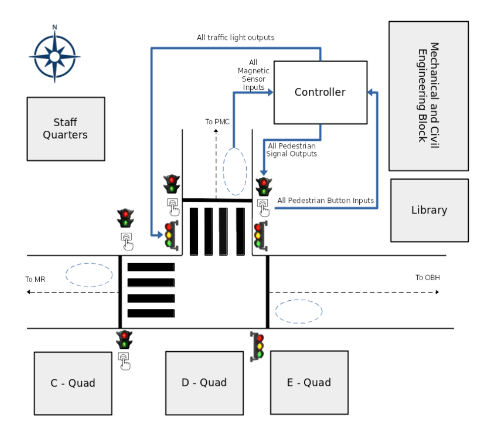
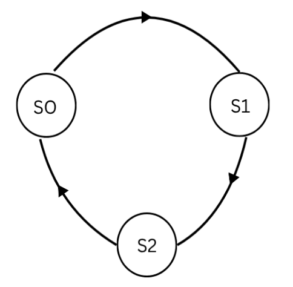
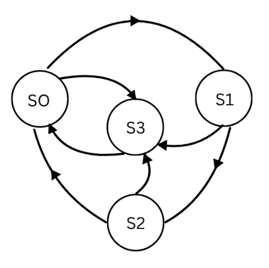

Design Specification Document
=============================

Introduction
------------

Fig:1- Traffic lignt system

The work is divided into three different stages as there are three 'intelligent' behaviour that the system needs to perform.

1. In this we design a normal traffic system that is only for the vehicles.There is no intelligent behaviour.

2. Here we add the first intelligent behaviour in the traffic system which consists the i/p(input) from the pedesterian button in 0's and 1's.

3. In last stage we add the two final behaviour related to the magnetic sensor and upgrade the pedesterian system. 

States
------

Implementation Stages
---------------------

Traffic Light System for Vehicles
^^^^^^^^^^^^^^^^^^^^^^^^^^^^^^^^^

Fig:2- Vehicle Traffic Squence

In the above image, different state for the traffic (only for Vehicels) is shown consedering the following as the states:-

(assuming green=G, yellow=Y, red=R.)

 S0 : the Esat-West{MR-OBH} traffic (both direction) for G=20 sec, Y=4 sec, R=2 sec.   

 S1 : the MR-PMC traffic for G=10 sec, Y=4 sec, R=2 sec.

 S2 : the OBH-PMC traffic for G=10 sec, Y=4 sec, R=2 sec. 

+-----+-----+----+--------+  
| OBH | PMC | MR | Output | 
+=====+=====+====+========+   
|  1  |  0  |  1 |   S0   |
+-----+-----+----+--------+
|  0  |  1  |  1 |   S1   |
+-----+-----+----+--------+
|  1  |  1  |  1 |   S2   |
+-----+-----+----+--------+
The above table show the state and there respective traffic where 1's are for the traffic to operate and 0's for traffic to halt in that state.

+-------+-------+-------+-------+-------+-------+--------+
| OBH(↑)| OBH(→)| OBH(←)| PMC(→)| PMC(↑)| PMC(←)| Output |
+=======+=======+=======+=======+=======+=======+========+
|   1   |   0   |   0   |   0   |   1   |   0   |  S0    |
+-------+-------+-------+-------+-------+-------+--------+
|   0   |   0   |   0   |   1   |   0   |   1   |  S1    |
+-------+-------+-------+-------+-------+-------+--------+
|   0   |   1   |   1   |   0   |   0   |   0   |  S2    |
+-------+-------+-------+-------+-------+-------+--------+
This table is the extended version in which the direction of the traffic flow is shown in different states. the directions are considered taking the prespective of the driver looking at there respective traffic light.

Pedestrian Crossing Sequence
^^^^^^^^^^^^^^^^^^^^^^^^^^^^

Fig: 3

The sequence for the pedestrian is considered new state S3.

Note:- Once the pedestrian botton is pressed all the vehicle traffic goes red and also did not take any other i/p from the button during the sequence. The pedestrian button i/p only taken when there is the traffc sequence not at all red.

The above state diagram is discribed as :-

 For S0→S1→S2 there is no i/p from the button.

 For S0→S3 or S1→S3 or S2→S3 there is i/p from the button.

where as when S3 compleat the sequence went back to S0 and goes-on.

Assuming button pressed as B(1) and not pressed as B'(0). Shown in the following table

+-----------------+-----+
| i/p from button | o/p |
+=================+=====+
|      0          |  B' |
+-----------------+-----+
|      1          |  B  |
+-----------------+-----+

The following table table shows the relation between the states and the traffic :-

+----+----+----+----+--------+
| S0 | S1 | S2 | S3 |   O/P  |
+====+====+====+====+========+
| 1  | 0  | 0  | 0  | OBH-MR |
+----+----+----+----+--------+
| 0  | 1  | 0  | 0  | MR-PMC |
+----+----+----+----+--------+
| 0  | 0  | 1  | 0  |OBH-PMC |
+----+----+----+----+--------+
| X  | X  | X  | 1  | HUMAN  |
+----+----+----+----+--------+

The last two intelligent behavior that consists the integration of the magneic sensor and its configuration with the above designed system.

In theis Fig:3 using as state diagram where the conditions to change the state  

Intelligent Behaviour
^^^^^^^^^^^^^^^^^^^^^

Implementation Guide
--------------------

Integration Guide
-----------------
